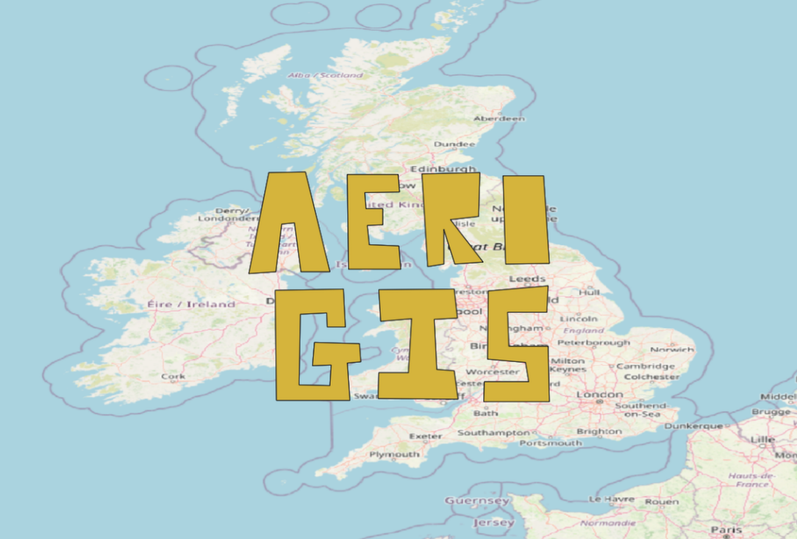
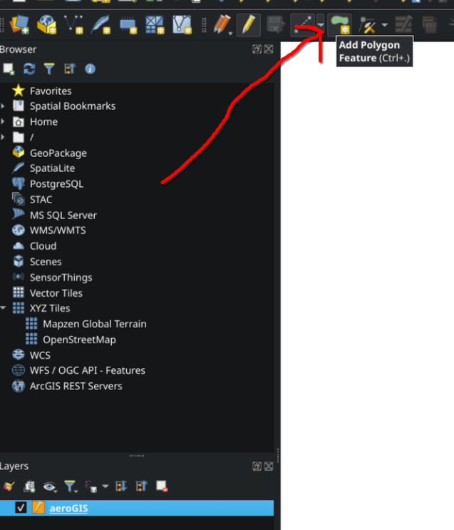

# AeroGIS Dataset

## Overview

This dataset contains the word "AeroGIS" represented as a Polygon in GeoJSON format. It is laid over the UK, and will be used to create an interactive homepage map for the AeroGIS project.

**Example output in QGIS:**



## Data Source

The AeroGIS dataset was created manually using QGIS.

### aeroGIS.geojson

The steps to create the dataset were as follows:

1. Create a new shapefile layer with Polygon geometry and EPSG:4326 coordinate reference system in QGIS.
2. For the fields list, add a field named "letter" of type Text (string) and length 1. This will store each letter of "AeroGIS".
3. Toggle editing mode for the new layer.
4. Use the "Add Polygon Feature" tool to draw each letter of "AeroGIS" on the map canvas.

   

5. Once a letter is drawn, a prompt will appear to enter the value for the "letter" field. Enter the corresponding letter (e.g., "A", "e", "r", etc.) and click OK.
6. Repeat steps 4-5 for each letter in "AeroGIS".
7. After all letters are drawn, toggle off editing mode and save the changes when prompted.
8. Finally, export the layer to GeoJSON format by right-clicking the layer in the Layers panel, selecting "Export" > "Save Features As...", choosing "GeoJSON" as the format, and specifying the output file path as `aeroGIS.geojson`.

### aeroGIS-centroid.json

In addition to the main AeroGIS dataset, a centroid JSON file named `aeroGIS-centroid.json` was created. This file contains the centroid of the entire "AeroGIS" polygon. The steps to create the centroid dataset were as follows:

1. Load the `aeroGIS.geojson` layer into QGIS.
2. Use the "Centroids" tool found in the Processing Toolbox under "Vector geometry" to calculate the centroid of each letter polygon.
3. Finally, apply the "Mean coordinates" tool to compute the overall centroid of the entire "AeroGIS" polygon layer.
4. Export the resulting centroid point to CSV format by right-clicking the centroid layer in the Layers panel, selecting "Export" > "Save Features As...", choosing "Comma Separated Value [CSV]" as the format, and specifying the output file path as `aeroGIS-centroid.csv`.

This file needs to be formatted as JSON to allow easy use within our JavaScript code. We can convert this manually due to the small size of the dataset. The final `aeroGIS-centroid.json` file looks like this:

```json
{
  "lat": xx.xxx,
  "lng": yy.yyy
}
```

## aeroGIS-logo-bounds.json

We also need to create a dataset to provide the bounds for the AeroGIS logo overlay on the homepage map. This dataset is stored in `aeroGIS-logo-bounds.json` and contains the northeast and southwest coordinates of the bounding box for the logo overlay. The steps to create this dataset were as follows:

1. Create a new shapefile layer with point geometry and EPSG:4326 coordinate reference system in QGIS.
2. For the fields list, add both id (type Integer length 10) and name (type Text (string) length 2) fields.
3. Toggle editing mode for the new layer.
4. Use the "Add Point Feature" tool to add two points representing the northeast and southwest corners of the bounding box for the logo overlay.
5. For each point added, enter the corresponding values for the "id" and "name" fields when prompted. I've used the following values:
   - Point 1: id = 0, name = "ne"
   - Point 2: id = 1, name = "sw"
6. Next, we need to add two calculated fields to store the latitude and longitude values for each point. Open the Attribute Table for the layer, click on the Field Calculator button, and create two new fields:
   - Field 1: name = "lat", type = Decimal number (real), length = 12, precision = 10, expression = $y
   - Field 2: name = "lng", type = Decimal number (real), length = 12, precision = 10, expression = $x
7. After adding the calculated fields, toggle off editing mode and save the changes when prompted.
8. Finally, export the layer to CSV format by right-clicking the layer in the Layers panel, selecting "Export" > "Save Features As...", choosing "Comma Separated Value [CSV]" as the format, and specifying the output file path as `aeroGIS-logo-bounds.csv`.

This file needs to be formatted as JSON to allow easy use within our JavaScript code. We can convert this manually due to the small size of the dataset. The final `aeroGIS-logo-bounds.json` file looks like this:

```json
{
  "ne": {
    "lat": xx.xxx,
    "lng": yy.yyy
  },
  "sw": {
    "lat": xx.xxx,
    "lng": yy.yyy
  }
}
```
