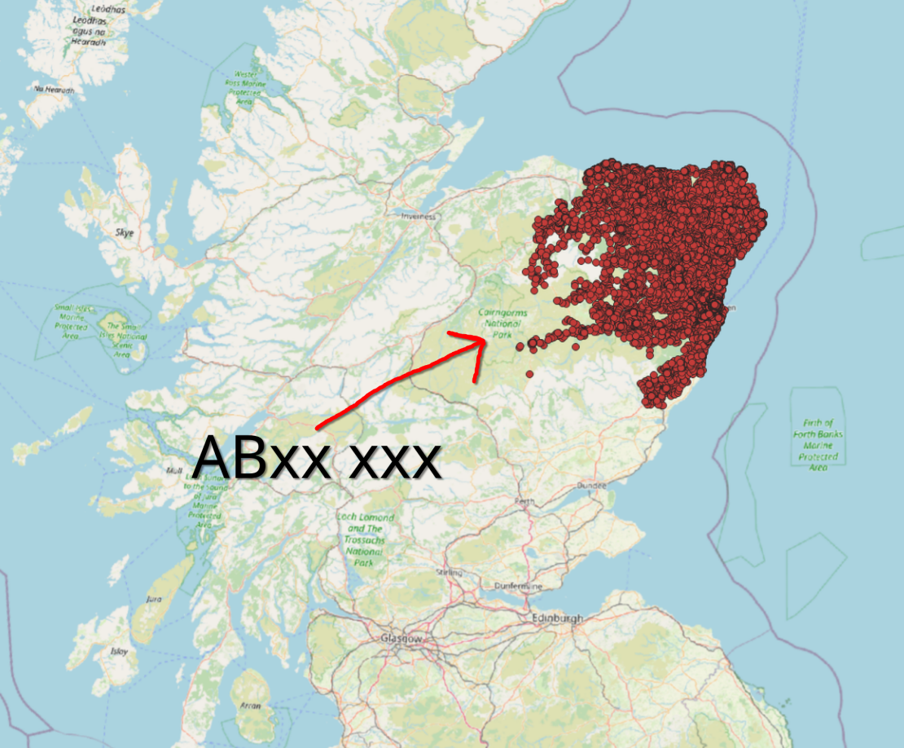

# Code-Point Open Dataset

## Overview

Code-Point Open is a dataset provided by Ordnance Survey that contains detailed information about postal codes in the United Kingdom. This dataset includes geographic coordinates for each postal code, allowing for spatial analysis and mapping of postal code areas.

**Example output in QGIS:**



(Note: This is for postcodes starting with "AB")

## Data Source

This dataset is sourced from Ordnance Survey's Code-Point Open product, which is freely available for public use. The data can be downloaded from the Ordnance Survey website.

[Ordnance Survey Code-Point Open](https://osdatahub.os.uk/data/downloads/open/CodePointOpen)

## Use in the project

The Code-Point Open dataset provides an array of CSV file, each containing postcode data for different regions of the UK. The files are named according to the initial letters of the postcodes they contain (e.g., "AB.csv" for postcodes starting with "AB").

Each CSV file contains a translation of postcode data into geographic coordinates (easting and northing). This will facilitate users being able to search with their postcode and see the location on a map.

## Data Modification

Unfortunately, due to the size of the dataset, it is not feasible to convert each postcode CSV file into a GeoJSON file for direct use in mapping applications. Instead, we will have to convert easting and northing coordinates to latitude and longitude on-the-fly when needed.

To achieve this, I have found an external API that can convert easting and northing to latitude and longitude:

- [https://www.getthedata.com/bng2latlong](https://www.getthedata.com/bng2latlong)

This will bridge the gap between the different coordinate systems (British National Grid to WGS84) and allow for accurate mapping of postcodes.

Simply send a GET request to the API with the easting and northing values as parameters to receive the corresponding latitude and longitude.

```js
fetch(
  "https://www.getthedata.com/bng2latlong?easting=EASTING_VALUE&northing=NORTHING_VALUE",
)
  .then((response) => response.json())
  .then((data) => {
    console.log("Latitude:", data.latitude);
    console.log("Longitude:", data.longitude);
  })
  .catch((error) => console.error("Error:", error));
```
