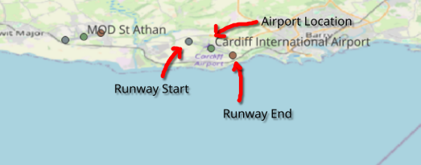

# OurAirports Dataset

## Overview

OurAirports is a comprehensive dataset of global airport information, including details such as airport codes, names, locations, and other relevant attributes. Within this project, we utilise the Airports and Runways datasets, containing valuable data for aviation-related analyses.

**Example output in QGIS:**

## Source

This dataset was sourced from OurAirports:

[OurAirports Data](https://ourairports.com/data/)

The datasets are available in CSV format and include various attributes for each airport and runway.

OurAirports also provide a data dictionary that details the fields and their meanings, which can be found here:

[OurAirports Data Dictionary](https://ourairports.com/help/data-dictionary.html)

## Use in the Project

This dataset is the primary data source of the project. OurAirports' `airports.csv` and `runways.csv` files provide essential information about airports and their associated runways worldwide. This dataset is the primary focus of the website.

## Data Modifications

To make this dataset more suitable for use within the project, the following modifications were made:

- Filtered the datasets to only include airports within the United Kingdom for focused analysis.
  - This was done using the UK Boundaries dataset to determine which airports fall within UK borders.
  - In QGIS, the "Select by location" tool within the processing toolbox was used to select airports within the UK polygons, and the selected features were then exported to new layers.
- Converted the CSV files to GeoJSON format for easier spatial analysis and visualization.
  - A dataset for airports: `ourAirports-airports.geojson`
  - A dataset for runway start points (Low number end): `ourAirports-runways-low.geojson`
  - A dataset for runway end points (High number end): `ourAirports-runways-high.geojson`

## Data Generation

Using the modified runway datasets, I was able to generate a polygon dataset representing the runway surfaces. This was achieved by creating lines between the low and high runway endpoints and then buffering these lines to create polygons that represent the physical runway areas. The datasets provide a width attribute for each runway, which was used to determine the buffer distance.

- Created a runway lines dataset by connecting the low and high runway endpoints.
  - In QGIS, I used the "Join by lines (hub lines)" tool within the processing toolbox to create lines between the low and high runway points based on a common runway ID.
  - This has been output to `ourAirports-runway-lines.geojson`.
- Buffered the runway lines using half the width attribute to create runway surface polygons.
  - Using QGIS's Field Calculator, I created a new field called width_m, which converted the width from feet to meters (width \* 0.3048). This additional field has been added to `ourAirports-runway-lines.geojson`.
  - Again using the Field Calculator, I created another new field called buffer_m, which is simply width_m divided by 2. This field represents the buffer distance needed to create the runway polygons.
  - Next, I had to convert to a projected coordinate system (EPSG:27700 - British National Grid) to ensure accurate buffering in meters (`ourAirports-runway-lines-OSGB36.geojson`).
  - Finally, I used the "Buffer" tool within QGIS (Vector > Geoprocessing Tools > Buffer) to create the runway polygons, using the buffer_m field as the buffer distance.
- The final output was saved in GeoJSON format (with the CRS EPSG:4326) as:
  - `ourAirports-runway-polys.geojson`: Contains the runway surface polygons and their attributes (i.e. surface material).

## Data Size Management and Website Optimisation

To improve performance and reduce load times on the website, I split each dataset into separate files based on country. This allows the website to only load the necessary data for the selected country, rather than loading the entire dataset at once.

To do this in QGIS I:

- Loaded each dataset into QGIS (`ourAirports-airports.geojson`, `ourAirports-runway-polys.geojson`).
- Loaded the UK Boundaries Countries dataset (`ukBoundaries-countries.geojson`). See the [UK Boundaries README](../ukBoundaries/README.md) for more information.
- For each country in the UK Boundaries dataset:
  - Filtered the boundary to the specific country.
  - Using the "Extract by location" tool within the processing toolbox, I extracted features from the OurAirports datasets that "are within" the selected country boundary.
  - Exported the extracted features to new GeoJSON files named according to the country, e.g.:
    - `ourAirports-airports-England.geojson`
    - `ourAirports-runway-polys-England.geojson`
    - And so on for Scotland, Wales and Northern Ireland.
