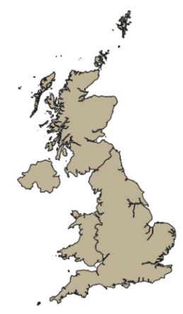

# UK Boundaries Dataset

## Overview

This datasets contains 4 polygons representing the boundaries of the countries within the United Kingdom: England, Scotland, Wales, and Northern Ireland.
In addition to these polygons, each object's attributes include the country's name, unique identifier and a longitude/latitude point representing its centroid.

**Example output in QGIS:**

## Source

This dataset was sourced from data.gov.uk:

[Countries December 2021 Boundaries UK BGC](https://www.data.gov.uk/dataset/96f3e623-6e54-4df2-808c-48dba5c98b55/countries-december-2021-boundaries-uk-bgc)

Available formats include ESRI Shapefile, GeoJSON, KML, and GML. For this project, the GeoJSON format was used.

The dataset is provided by the Office for National Statistics (ONS).

## Use in the Project

This dataset is mainly used as a utility for manipulating the other datasets within the project. For example, it can be used to filter airports or runways by country within the UK.

## Data Modifications

In order to make this dataset more suitable for use within the project, the following modifications were made:

- Created a line geometry version of the polygons to represent country borders. This was done using QGIS's "Polygon to lines" tool.
- Converted both the polygon and line datasets to use the WGS 84 (EPSG:4326) coordinate reference system for consistency with other datasets. This also increases compatibility with the Google Maps API.

The final outputs were saved in GeoJSON format as:

- `ukBoundaries-countries.geojson`: Contains the country polygons.
- `ukBoundaries-borders.geojson`: Contains the country border lines.
